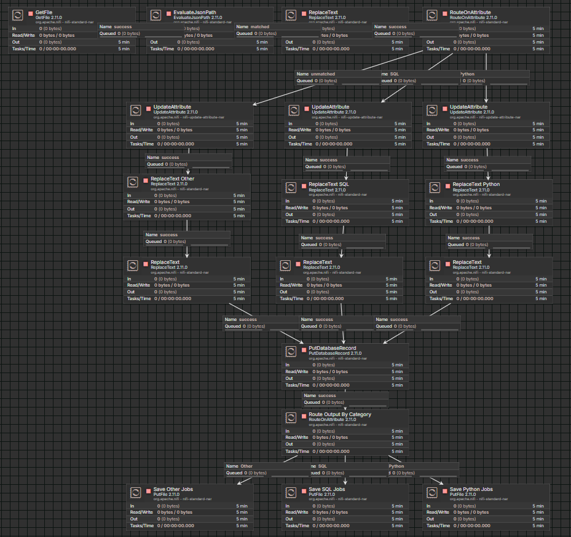
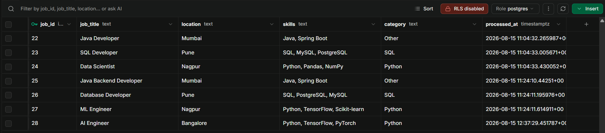
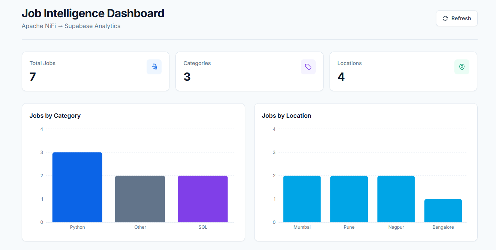
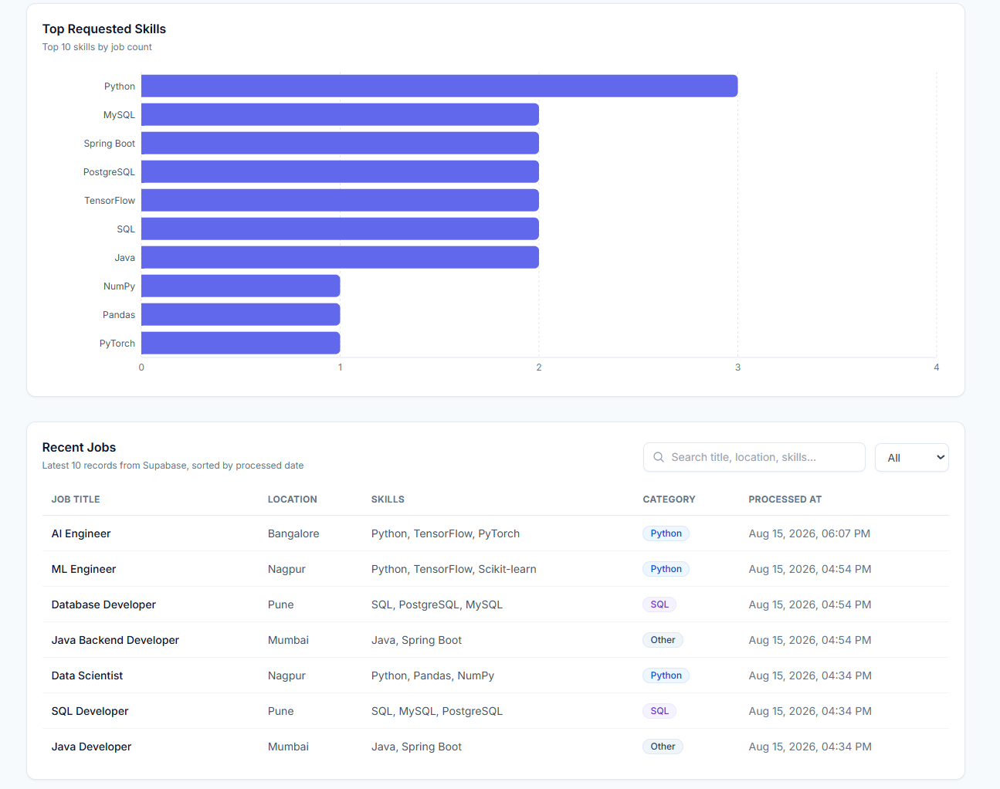

# Job Intelligence Pipeline

An end-to-end job data ingestion, transformation, classification, cloud storage, and analytics system built using **Apache NiFi, Supabase PostgreSQL, and React**.

The system automatically processes job data supplied as JSON files, extracts relevant attributes, classifies jobs into categories, transforms the data into a database-ready format, stores the processed records in Supabase PostgreSQL, and presents the resulting data through an interactive React analytics dashboard.

---

## Architecture

```text
                    Job JSON Input
                          │
                          ▼
                   ┌─────────────┐
                   │ Apache NiFi │
                   └──────┬──────┘
                          │
                          ▼
                  EvaluateJsonPath
                          │
                          ▼
                  RouteOnAttribute
                    /     |      \
                   /      |       \
              Python     SQL     Other
                 │        │        │
                 ▼        ▼        ▼
          UpdateAttribute
                 │
                 ▼
             ReplaceText
                 │
                 ▼
         PutDatabaseRecord
                 │
                 ▼
       Supabase PostgreSQL
                 │
                 ▼
          Analytics Views
                 │
                 ▼
          React Dashboard
```

## Project Overview

The pipeline is designed to automate the processing of job-related data.

A job is initially provided as a JSON file containing information such as:

```json
{
  "job_title": "AI Engineer",
  "location": "Bangalore",
  "skills": "Python, TensorFlow, PyTorch"
}
```

Apache NiFi processes the file and performs:

- JSON ingestion
- JSON field extraction
- Job classification
- Attribute management
- Data transformation
- CSV record preparation
- Database insertion

The processed record is stored in Supabase PostgreSQL.

The React dashboard then retrieves the stored data and presents analytical insights.

## Data Pipeline

### 1. Job Input

The system accepts job information as JSON.

Example:

```json
{
  "job_title": "Python Developer",
  "location": "Nagpur",
  "skills": "Python, Pandas, NumPy"
}
```

### 2. JSON Processing

Apache NiFi uses EvaluateJsonPath to extract fields from the incoming JSON.

The extracted attributes include:

- job_title
- location
- skills

### 3. Job Classification

RouteOnAttribute evaluates the extracted job information and routes records into:

- Python
- SQL
- Other

This allows different categories of jobs to be processed through the appropriate branch.

### 4. Data Transformation

The category is stored as a FlowFile attribute and the job data is transformed into a database-ready CSV representation.

Special handling is applied to the skills field because it can contain multiple comma-separated values.

Example:

```
job_title,location,skills,category
AI Engineer,Bangalore,"Python, TensorFlow, PyTorch",Python
```

### 5. Database Insertion

The transformed records are passed to PutDatabaseRecord.

Apache NiFi connects to the Supabase PostgreSQL database through a PostgreSQL connection pool.

The records are inserted into the `jobs` table.

### 6. Output Routing

After successful database insertion, another RouteOnAttribute routes the processed FlowFile according to its category.

- Python → Python output
- SQL    → SQL output
- Other  → Other output

This prevents the same output file from being written to all three category folders.

## Database

The primary table is `jobs`.

The table contains:

| Column | Description |
|---|---|
| job_id | Unique job identifier |
| job_title | Job title |
| location | Job location |
| skills | Required skills |
| category | Classified job category |
| processed_at | Processing timestamp |

### Analytics Views

The database contains analytical views used by the dashboard.

#### job_summary

Provides:

- Total jobs
- Total categories
- Total locations

#### jobs_by_category

Provides job counts grouped by category.

#### jobs_by_location

Provides job counts grouped by location.

#### jobs_by_skill

Provides skill frequency information by splitting the comma-separated skills stored in the jobs table.

## React Dashboard

The frontend is located in `frontend/`.

The dashboard provides:

- Total Jobs
- Total Categories
- Total Locations
- Jobs by Category
- Jobs by Location
- Top Requested Skills
- Recent Jobs
- Job Search
- Category Filter
- Refresh functionality

### Frontend Structure

```
frontend/
│
├── public/
│
├── src/
│   ├── components/
│   │   ├── CategoryChart.jsx
│   │   ├── DashboardHeader.jsx
│   │   ├── EmptyState.jsx
│   │   ├── ErrorMessage.jsx
│   │   ├── LoadingState.jsx
│   │   ├── LocationChart.jsx
│   │   ├── RecentJobs.jsx
│   │   ├── SkillsChart.jsx
│   │   └── SummaryCards.jsx
│   │
│   ├── lib/
│   │   └── supabase.js
│   │
│   ├── services/
│   │   └── jobService.js
│   │
│   ├── App.jsx
│   ├── index.css
│   └── main.jsx
│
├── .env.example
├── .gitignore
├── package.json
├── package-lock.json
├── postcss.config.js
├── tailwind.config.js
└── vite.config.js
```

### Dashboard Data Flow

```
Supabase PostgreSQL
        │
        ├── job_summary
        ├── jobs_by_category
        ├── jobs_by_location
        ├── jobs_by_skill
        │
        └── jobs
             │
             ▼
       Supabase Client
             │
             ▼
       React Dashboard
             │
       ┌─────┼──────────┐
       ▼     ▼          ▼
    Cards  Charts   Recent Jobs
```

## Environment Configuration

The frontend uses environment variables for Supabase configuration.

Create a `.env` file inside `frontend/` with:

```
VITE_SUPABASE_URL=your_supabase_project_url
VITE_SUPABASE_PUBLISHABLE_KEY=your_supabase_publishable_key
```

The repository contains `.env.example` as a template.

## Security

The Supabase service-role key must never be exposed in the frontend or committed to GitHub.

## Running the Dashboard

Navigate to the frontend directory:

```bash
cd frontend
```

Install dependencies:

```bash
npm install
```

Start the development server:

```bash
npm run dev
```

Vite will provide a local development URL.

## Testing

The complete pipeline was tested using new job records.

Example test:

```json
{
  "job_title": "AI Engineer",
  "location": "Bangalore",
  "skills": "Python, TensorFlow, PyTorch"
}
```

The record was successfully:

```
JSON
 ↓
Apache NiFi
 ↓
Python classification
 ↓
Data transformation
 ↓
Supabase PostgreSQL
 ↓
React Dashboard
```

The corresponding local output was also routed to the correct category-specific output folder.

## Results

The final system successfully demonstrates:

- Automated job data processing
- Conditional data routing
- Structured data transformation
- Cloud PostgreSQL storage
- Database analytics
- Interactive data visualization
- End-to-end integration between an ETL pipeline and a web dashboard

## Future Improvements

Potential future enhancements include:

- Automated job-source/API ingestion
- More advanced job classification
- Skill normalization
- Duplicate job detection
- Scheduled ingestion
- Pipeline monitoring
- Authentication for the dashboard
- Advanced job trend analytics
- Deployment of the dashboard
- Automated data quality checks

## Project Highlights

This project combines:

**Data Engineering + ETL + Cloud Database + Analytics + Frontend Visualization**

The main workflow is:

**Ingest → Extract → Classify → Transform → Store → Analyze → Visualize**

---

## Screenshots

### Apache NiFi ETL Pipeline

The complete Apache NiFi pipeline processes incoming job data, classifies records by category, stores them in PostgreSQL, and routes the final files to category-specific output folders.



### Supabase PostgreSQL Database

Processed job records are stored in a PostgreSQL database hosted on Supabase.



### Job Intelligence Dashboard — Overview

The dashboard provides real-time job counts, category distribution, and location-based analytics.



### Job Intelligence Dashboard — Skills & Recent Jobs

The dashboard also provides skill-demand analysis and a searchable list of recently processed jobs.



## Author

**Ishan Pote**

Computer Science undergraduate specializing in Data Science.

Interested in:

- Data Science
- Machine Learning
- Data Engineering
- Generative AI
- Analytics
- Autonomous AI Systems